# KALI Backend — Component Diagram (C4 Level 3)

**Audience:** Developers working on backend (`kernel/*`).
**Purpose:** Map the Python modules inside `kali-backend.exe` and how they collaborate.

**Prerequisite:** Read [c4-containers.md](c4-containers.md) first — this zooms into the "FastAPI Backend" container.

## Diagram

```mermaid
C4Component
  title Component Diagram — FastAPI Backend Internals

  Container_Ext(shell, "Tauri Shell", "WebView2", "UI client")
  ContainerDb_Ext(db, "SQLite DB", "aiosqlite")
  Container_Ext(f5, "F5-TTS Engine", "PyTorch", "Local voice")
  Container_Ext(stt, "Whisper STT + VAD", "faster-whisper + Silero")
  System_Ext(cloud, "Cloud APIs", "Claude / OpenAI / ElevenLabs / GitHub / NeuralDeep")

  Container_Boundary(backend, "FastAPI Backend (kernel/)") {
    Component(main, "FastAPI App", "main.py", "HTTP/WS routes. Thin — delegates to components below.")
    Component(bus, "Event Bus", "event_bus.py", "In-process pub/sub. Decouples pipeline, UI updates, audit logging.")
    Component(config, "Config Manager", "config.py + models.py", "YAML config (config/kali.yaml) + Pydantic validation + hot reload.")
    Component(persona, "JARVIS Persona", "jarvis_persona.py", "Unified system prompt for every LLM call — butler tone, RU-first.")

    Component(voice, "Voice Pipeline", "voice/pipeline.py", "Orchestrates recorder → VAD → wake-word → STT → LLM → TTS. Stateful per turn.")
    Component(ttsRouter, "TTS Router", "voice/tts_router.py", "Selects F5 vs ElevenLabs per hardware + env. Fallback on failure.")
    Component(sounds, "JARVIS Sound Pack", "voice/jarvis_sounds.py", "Fast-path pre-recorded clips — bypasses TTS for common phrases.")

    Component(llmRouter, "LLM Router", "llm_router.py", "Unified Claude/OpenAI/Google/DeepSeek interface. Budget + retry.")

    Component(runtime, "Agent Runtime", "agent_runtime/", "Loads agents in-process, dispatches tool calls, tracks status.")
    Component(registry, "Plugin Registry", "plugin_registry.py", "Discovers agents on disk. Dual loader — legacy manifest.yaml + SKILL.md.")

    Component(skills, "Skills Module", "skills/", "SKILL.md loader, validator, catalog aggregator, installer, publisher.")
    Component(executor, "Skill Executor", "skill_executor.py + skill_templates/", "Runs YAML-configured skills (tracker/reminder/monitor/notifier/logger).")

    Component(catalog, "Catalog Aggregator", "skills/catalog.py", "Multi-source: GitHub trees + NeuralDeep JSON API. Cached 1h.")

    Component(builder, "Builder", "builder/", "Intent classify → wizard Q/A → skill/agent gen → safety → deploy.")
    Component(flow, "BuilderFlow ★", "builder/flow.py (pilot)", "NEW — single orchestrator for voice builder pilot. Wraps intent/wizard/generate/deploy.")

    Component(sandbox, "Sandbox", "sandbox/", "Permission enforcer, rate limiter, audit log (SQLite), whitelisted HTTP client.")

    Component(scheduler, "Scheduler", "scheduler.py", "Cron triggers for skills (every N hours, daily, etc.). croniter-based.")
    Component(models, "Model Downloader", "model_downloader.py", "Validates/downloads F5 + whisper models on first run.")
    Component(integrations, "Integrations", "integrations/", "OAuth helpers — Google Calendar/Gmail, Telegram bot, Home Assistant.")
  }

  Rel(shell, main, "REST + WS", "HTTP/3005")

  Rel(main, bus, "Publish + subscribe")
  Rel(main, voice, "Start/stop voice pipeline")
  Rel(main, runtime, "Dispatch tool calls to agents")
  Rel(main, skills, "List/install/publish")
  Rel(main, catalog, "Browse remote skills")
  Rel(main, builder, "Classify + wizard + deploy")
  Rel(main, config, "Read/write user config")

  Rel(voice, stt, "Read microphone, transcribe", "in-process")
  Rel(voice, ttsRouter, "Synthesize response")
  Rel(voice, sounds, "Fast-path common phrases")
  Rel(voice, llmRouter, "Generate reply for transcribed text")
  Rel(voice, flow, "Divert on 'создай агента' trigger (pilot)")

  Rel(ttsRouter, f5, "Local GPU path")
  Rel(ttsRouter, cloud, "ElevenLabs fallback", "HTTPS")

  Rel(builder, flow, "New orchestrator owns the flow")
  Rel(flow, catalog, "May seed from template")
  Rel(flow, executor, "Deploy skill")
  Rel(flow, runtime, "Deploy agent")

  Rel(runtime, registry, "Discover agents")
  Rel(runtime, sandbox, "Enforce permissions on tool call")
  Rel(executor, sandbox, "Audit skill actions")
  Rel(executor, integrations, "OAuth-backed API calls")

  Rel(skills, catalog, "Aggregate sources")
  Rel(scheduler, executor, "Fire cron triggers", "Topic: skill.{name}.trigger")

  Rel(llmRouter, cloud, "LLM API calls", "HTTPS")
  Rel(catalog, cloud, "GitHub + NeuralDeep fetches", "HTTPS")

  Rel(runtime, db, "Agent status + audit", "aiosqlite")
  Rel(sandbox, db, "Audit log", "aiosqlite")
  Rel(config, db, "User settings", "aiosqlite")

  UpdateLayoutConfig($c4ShapeInRow="3", $c4BoundaryInRow="1")
```

★ = new component added by [voice-builder-pilot plan](../superpowers/plans/2026-04-22-voice-builder-pilot.md).

## Key Collaborations

### Voice Turn (wake-word → LLM response → TTS)
1. `voice/pipeline.py` reads mic chunks via `recorder.py`
2. Per chunk: `vad.py` classifies speech/silence
3. `wake_word.py` (OpenWakeWord) fires on "Джарвис"
4. Accumulated speech sent to `stt.py` (faster-whisper) → text
5. Text → `builder/flow.py` (if matches create-agent trigger) OR `llm_router.py` → reply text
6. `tts_router.py` picks F5 (GPU) or ElevenLabs (cloud) → audio
7. `jarvis_sounds.py` fast-paths common phrases before TTS
8. Events published to `event_bus` — shell subscribes for UI state updates

### Voice Builder Flow (pilot)
1. STT transcribes "Создай агента, который напомнит пить воду"
2. `voice/pipeline.py` matches builder trigger pattern → calls `builder/flow.py::start()`
3. `flow.py` runs `intent_classifier` (Claude or regex fallback) → {type=skill, template=reminder}
4. `flow.py` creates `wizard` with template questions, returns first via TTS
5. User answers voice → STT → `flow.py::answer()` stores answer, returns next question or preview
6. Preview spoken: "Я создам water-reminder. Запускать?"
7. User says "да" → `flow.py::deploy()` → `skill_generator.generate_skill()` + `deployer.deploy_skill()` → live

### Agent Store → Install
1. Shell calls `GET /catalog/list`
2. `main.py` → `skills/catalog.py::list_all()` → aggregates from `DEFAULT_SOURCES`
3. For each source: GitHub tree API or NeuralDeep JSON API, cached 1h
4. User picks skill → `POST /catalog/install` → `skills/installer.py`
5. Downloads SKILL.md, validates, writes to `agents/{name}/`
6. `plugin_registry.discover()` picks it up, runtime loads it

### Safety Boundaries
- Generated Python agents passed through `builder/safety_gate.py` — AST check for blocked imports (subprocess, socket, ctypes) and builtins (eval, exec).
- Runtime `sandbox/permission_enforcer.py` gates every tool call — network, filesystem, shell access are per-manifest permissions.
- `sandbox/rate_limiter.py` throttles external calls per agent, sliding window.
- `sandbox/audit.py` logs every sandboxed action to SQLite — inspectable via Activity UI.

## Module Size Discipline

Guideline: ≤800 LOC per file, ≤50 LOC per function (from `C:\Users\User\.claude\rules\code-quality.md`).

Current violators (as of 2026-04-22):
- `kernel/main.py` — ~1400 LOC (FastAPI app with all endpoints inline). **TODO:** split per feature (`routers/voice.py`, `routers/skills.py`, `routers/builder.py`) after pilot ships.
- No other backend file exceeds limits.

## Not Shown

- **Telemetry / metrics** — not implemented yet. Will appear as a component once added.
- **WebSocket notification dispatcher** — technically inside `main.py`, elided for clarity.
- **Builder subcomponents** (`intent_classifier`, `wizard`, `safety_gate`, `deployer`, `skill_generator`, `agent_generator`) — collapsed into one "Builder" box at this level. See [c4-components-voice-builder.md](c4-components-voice-builder.md) for the zoom-in.
