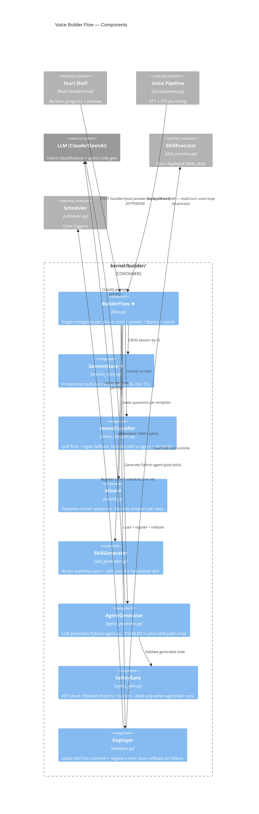
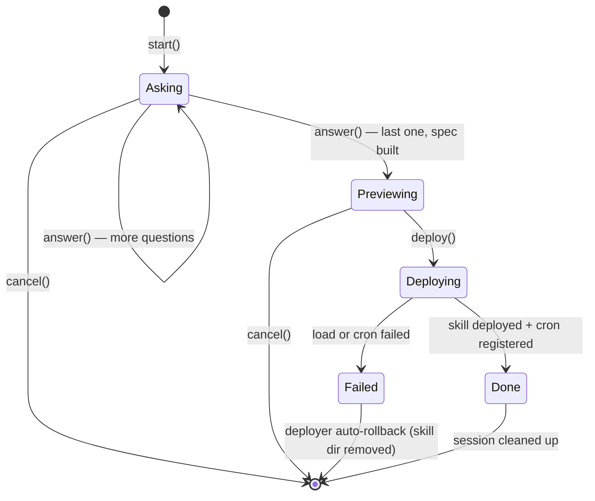
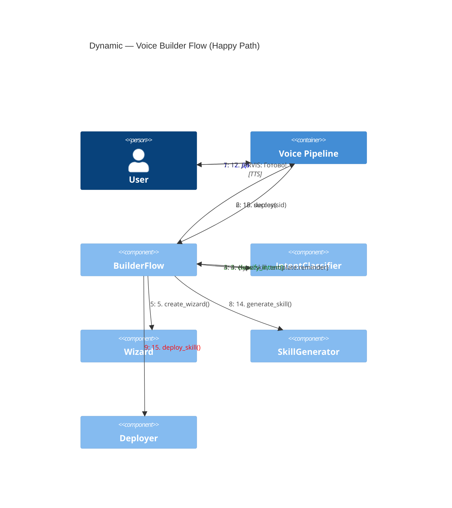

# Voice Builder Flow — Component Diagram (C4 Level 3)

**Audience:** Developers implementing the voice-builder-pilot.
**Purpose:** Zoom into the `builder/` module and show how voice input becomes a deployed skill in ≤60s.

**Prerequisite:** Read [c4-components-backend.md](c4-components-backend.md) — this expands the "Builder" box.

**Status:** Pilot design. Matches [docs/superpowers/plans/2026-04-22-voice-builder-pilot.md](../superpowers/plans/2026-04-22-voice-builder-pilot.md).

## Component Diagram

★ = new components introduced by the pilot. Others already exist.

## Why BuilderFlow Exists (the "new orchestrator")

Before pilot: each builder module works in isolation. Classifier returns intent. Wizard returns questions. Generator writes files. Deployer deploys. No single place owns "start → deploy" as a stateful flow.

Result: every caller (HTTP endpoint, voice pipeline) re-implements the same orchestration. Duplication + drift risk.

After pilot: `BuilderFlow` is the one orchestrator. HTTP endpoints thin. Voice pipeline thin. Both call the same 4 methods:
- `start(request)` → classify + create wizard + return first question
- `answer(session_id, text)` → record answer, return next question OR preview
- `deploy(session_id)` → materialise + deploy + clean session
- `cancel(session_id)` → drop session

## Session State Machine

## Dynamic View — Voice Happy Path (<60s budget)

## Latency Budget Breakdown

| Step | Budget | Notes |
|---|---|---|
| STT (wake word detect → text) | ~300ms | faster-whisper base model on CPU |
| Intent classify | ~800ms | Claude API; regex fallback ~1ms |
| Wizard question generation | <1ms | In-memory template lookup |
| TTS question speak | ~600-1500ms | F5 cold start 5-10s; warm 600ms |
| User response (pause + answer) | ~3-5s | Human speaking |
| `answer()` + build spec | <1ms | |
| Generate YAMLs | ~10ms | File writes |
| Load into runtime | ~50ms | Python import + validate |
| Register cron | <1ms | |

**Target: ≤60s wall-clock from "скажи идею" to "агент работает"** — achievable with 3 wizard questions and warm F5.

**Failure mode if budget exceeded:** likely F5 cold-start on first TTS call. Mitigation: preload F5 on backend startup (model_downloader hook). Monitor first-run vs subsequent.

## Why AgentGenerator is off in Pilot

Intent classifier may return `type="agent"` for open-ended requests ("сделай мне агента для парсинга криптобирж"). The `agent_generator` module uses LLM to produce Python code, then `safety_gate` does AST validation.

Pilot guards against this path — `BuilderFlow.start()` raises ValueError if `intent.type == "agent"`. Why:
- Skills = deterministic, fast, safe. Failure rate near zero.
- Agents = LLM-generated code, non-deterministic, has safety blind spots (network whitelist, runtime errors).

Re-enabling path: [docs/superpowers/plans/2026-04-25-agent-python-generation.md](../superpowers/plans/2026-04-25-agent-python-generation.md). Trigger: skills pipeline stable for 2+ weeks with ≥5 real users, ≥95% deploy success rate.

## Test Strategy (per pilot plan)

- **Unit:** `test_session_store.py`, `test_flow.py` — mocked intent, mocked LLM, file IO to tmp_path.
- **Integration (ASGI):** `test_builder_endpoints.py` — spin up FastAPI with httpx AsyncClient, full 4-endpoint sequence.
- **Voice unit:** `test_pipeline_builder_integration.py` — trigger patterns + multi-turn state transitions, mocked BuilderFlow.
- **E2E:** `tests/e2e/test_builder_voice_e2e.py` — wall-clock <60s, verifies skill files on disk.
- **Demo harness:** `tools/demo_builder.py` — prints timestamped trace for screen recording.

## Open Questions / Risks

- **STT mishears "создай"** — `_detect_builder_trigger` has 5 patterns (создай/сделай + агент/скилл); confirmation question adds safety. If miss rate high, add fuzzy match.
- **User says ambiguous "нет"** — deterministic keyword list; if both positive and negative words present, re-ask.
- **Long wizards fatigue user** — pilot templates max 3 questions. Enforce during skill-template design.
- **Deploy fails after answer finished** — `deployer` auto-rolls back. Flow tells user: "Не получилось, давай переделаем?". Session reset.
