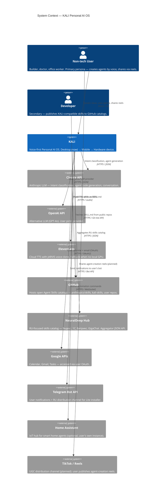

# KALI — System Context (C4 Level 1)

**Audience:** Everyone — product, engineering, investors, new contributors.
**Purpose:** Position KALI in its ecosystem. Who uses it? What does it talk to?

## Diagram

## What This Shows

**Primary users are non-tech people** (строитель, врач, офисник 30+), not developers. KALI's distribution thesis is UGC — users share agent-creation reels on TikTok/Reels, friends install, the loop compounds.

**KALI is an orchestrator, not a monolith.** It speaks to cloud LLMs (Claude, OpenAI), cloud TTS (ElevenLabs), open catalogs (GitHub, NeuralDeep), user services (Google, Telegram, Home Assistant). Everything that can be external is external — the only *first-party* assets are voice models (F5-TTS), UX, and the Agent Skills runtime.

**Developers are a secondary persona** — they publish skills to GitHub, which KALI consumes through its multi-source catalog aggregator. We don't ship a developer IDE; we ship a voice client that happens to consume developer-authored skills.

## Key Decisions Encoded Here

- **Open standard over proprietary:** KALI uses Anthropic's Agent Skills spec (`SKILL.md`), not a custom format. Any skill authored for Claude Code / Cursor works here.
- **Russian market first:** NeuralDeep integration gives ~40+ RU-native skills (Яндекс, 1С, Битрикс) on day one, something no global competitor has.
- **Voice is the channel, not the feature:** Every external system must be reachable through voice commands via an agent. GUI is safety net, not primary.

## External Dependencies — Risk Register

| System | Blast radius if down | Fallback |
|---|---|---|
| Claude API | Agent creation stalls | OpenAI (if configured); eventual Ollama local |
| ElevenLabs | Voice on CPU-only users | Pre-recorded clips + degraded silent mode |
| GitHub API | No new skills / rate limit (60/hr unauth) | Cached catalog; `GITHUB_TOKEN` raises to 5000/hr |
| NeuralDeep | 40+ RU skills unavailable | Other catalog sources still work |
| Google OAuth | Calendar/Gmail agents fail | Other agents unaffected |

## Not Shown (By Design)

- **Supabase / own cloud backend** — removed from scope. KALI is local-first; monetization infrastructure (auth, billing, telemetry) will be added in Phase 2 but doesn't belong in initial context.
- **Mobile / hardware device** — on roadmap but not yet a deployed system. Will be added when Mobile client exists.
