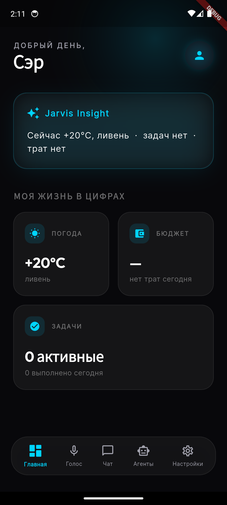
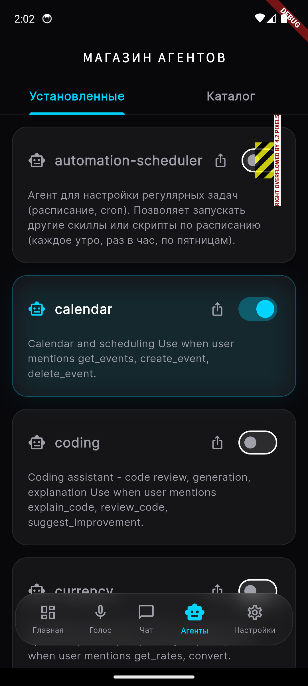
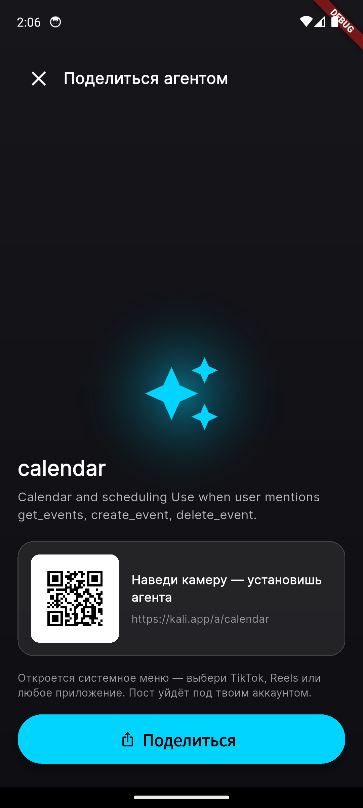
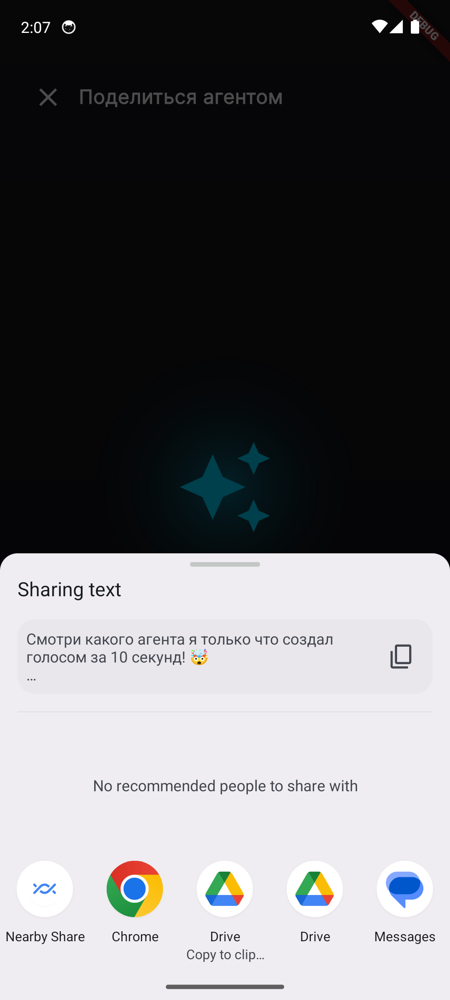

<!-- _class: lead -->
<!-- _paginate: false -->

# KALI

## Скажи — и получи личного ИИ на своём железе. Поделись им, как видео.
Say it — get a personal AI on your own machine. Share it like a video.

**Голосовой создатель ИИ-агентов для непрограммистов** · *Voice-first AI agent creator*

---

## Проблема
The problem

- Непрограммист 30+ — **строитель, врач, таксист** — тонет в рутине.
- Каждый инструмент автоматизации требует **кода или настройки**.
- Гиганты строят ИИ для **разработчиков в облаке** — не для него.

Обычный человек не может автоматизировать свою жизнь — всё требует кода.
Non-coders can't automate their lives — every tool needs code.

---

## Решение
The solution — the wedge

Голос → рабочий приватный агент. **Локально. Без кода. За 3 минуты.**

- Говоришь, что нужно
- Джарвис **строит** агента и **сам проверяет** его
- Запускает на **твоём железе**
- **Помнит** тебя

Voice in → a working, private agent. Local. No code.

---

## Это работает сегодня
Real today — not a promise

- Голос RU **вход и выход** на локальном GPU
- **Создание агента голосом** → деплой на диск
- Магазин помощников, **честные статусы**
- **Локальная память** — данные на твоей машине

Desktop — основной, GPU-голос. Mobile — компаньон (на скринах). Оба реальны.

---

## Стратегия: ров — на краях
The moat is the edges, not the model

Статичная ОС → **генеративная ОС**: «скажи, что хочешь — система соберёт».

- **Непрог-голос** — единственный интерфейс для строителя/врача
- **Локальное доверие** — данные не уходят в облако
- **UGC** — дистрибуция внутри продукта

Модель — commodity, сменная. Мы не воюем с OpenAI на моделях — мы их используем.
The model is a commodity. The edges are the moat.

---

## Рост: петля UGC
Growth = the loop, not the ad budget

Создал голосом → **ролик / ссылка** → друг сканирует **QR** → ставит в один тап → строит свой.

- Дистрибуция живёт **внутри продукта**
- Пользователи приводят пользователей
- **Без рекламного бюджета**

Distribution lives inside the product. Users bring users.

---

## Делишься, как видео
Share like a video — already built

Нативный share sheet → **TikTok / Instagram / YouTube** под своим аккаунтом.

- Без OAuth-интеграций платформ — **ОС делает всю работу**
- Агент «путешествует» внутри ссылки/QR — ставится без сервера

На скрине — реальное системное меню «Поделиться». Не макет.

---

## Почему сейчас
Why now

Модели **коммодитизируются** → ценность уходит с модели на **края**: доверие, дистрибуция, интерфейс для обычных людей.

Три «ручки» едут вперёд **без переписывания**:

- облако → **локаль**
- описания → **код**
- приложение → **самособирающаяся оболочка**

Value moves off the model, onto the edges. KALI is built to ride that curve.

---

## Будущее
The North Star — one path, no rewrite

Та же архитектура едет по лесенке:

- **A** — приложение сегодня (голос + магазин)
- **B** — интерфейс **сам собирается** под задачу
- **C** — выделенное **железо** («Iron Man»)

Ближайший продукт — «скажи, получи агента, поделись» — стоит на том, что уже работает.

Same path, no rewrite: app → self-composing UI → device.

---

## Честно о трекшне
Honest traction — strong demo ≠ PMF

Сильное демо + работающий продукт. **PMF доказываем удержанием** в закрытой бете.

Воронка, которую меряем:

- **Активация** — % создавших ≥1 агента голосом
- **Удержание** — возврат на 7 / 30 день
- **K-фактор** — % поделившихся → друзья установили

Не считаем успехом: установка без активации; всплеск от друзей вместо органики.

---

## Почему мы
Why us

- Соло-основатель = **оркестратор AI-агентов**. Продукт уровня команды — за месяцы. *Капитал-эффективность.*
- Дисциплина: **written scope + анти-пивот** (не лезем на dev/design-поляну).
- Архитектура (**Rust-ядро, generative-OS, сменная модель**) заложена под масштаб.

Solo founder orchestrating AI — a team-level product in months.

---

<!-- _class: lead -->

## Запрос
The ask

### __[сумма]__ на бету, команду и железо — до __[майлстоунов]__

 

**«Скажи — получи личного ИИ. Поделись им, как видео.»**
"Speak — get a personal AI. Share it like a video."
